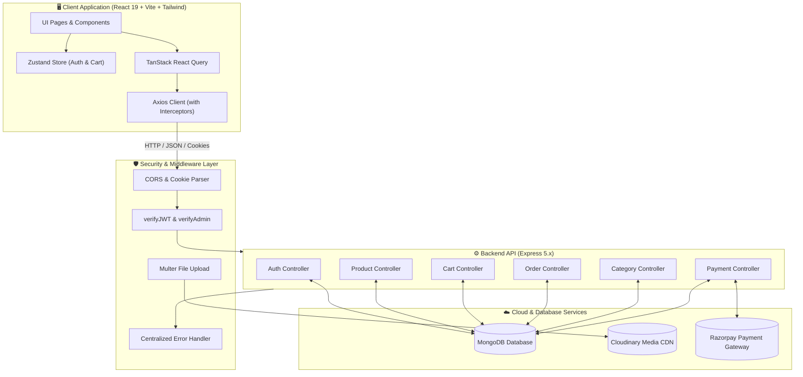

<div align="center">

# 🛍️ SHOPERA

**A Modern, High-Performance Full-Stack E-Commerce & Merchant Management Platform**

[](https://react.dev/)
[](https://vitejs.dev/)
[](https://tailwindcss.com/)
[](https://nodejs.org/)
[](https://expressjs.com/)
[](https://www.mongodb.com/)
[](https://razorpay.com/)
[](https://cloudinary.com/)
[](LICENSE)

<p align="center">
  <a href="#-key-features">Key Features</a> •
  <a href="#-tech-stack">Tech Stack</a> •
  <a href="#-system-architecture">Architecture</a> •
  <a href="#-project-structure">Project Structure</a> •
  <a href="#-quick-start">Quick Start</a> •
  <a href="#-demo-credentials">Demo Credentials</a> •
  <a href="#-api-documentation">API Reference</a> •
  <a href="#-deployment">Deployment</a>
</p>

---

</div>

## 📌 Overview

**Shopera** is an enterprise-grade, full-stack e-commerce platform built on the modern MERN stack with **React 19**, **Node.js (ES Modules)**, **Express 5**, and **MongoDB**. It combines a sleek, ultra-responsive customer storefront with a comprehensive merchant administration back-office.

Designed with scalability, security, and developer ergonomics in mind, Shopera utilizes npm workspaces for monorepo management, JWT authentication with secure HTTP-only cookies, automated product seeding, seamless Razorpay payment integration, and Cloudinary media management.

---

## ✨ Key Features

### 🛒 Customer Storefront Experience
- **Dynamic Homepage & Discovery**: Hero banners, trending products, category spotlights, promotional ribbons, and interactive product cards.
- **Advanced Filtering & Search**: Instant filtering by categories, price sliders, customer ratings, in-stock status, and multi-parameter sorting (price, newest, rating, popularity).
- **Rich Product Details**: High-resolution image galleries, real-time stock indicators, product specifications, discount calculation, and customer reviews.
- **Smart Cart Management**: Persistent cart backed by Zustand and synced with the database upon authentication.
- **Frictionless Checkout**: Multi-step checkout with address selection, address creation on the fly, delivery notes, and multiple payment methods.
- **Payment Processing**: Seamless Razorpay payment gateway integration with cryptographic HMAC-SHA256 signature verification and Cash on Delivery (COD) support.
- **Order Tracking & Management**: Detailed timeline tracking (`Pending` ➔ `Processing` ➔ `Shipped` ➔ `Delivered`), order cancellation workflows, item breakdown, and delivery preferences.
- **Customer Account Portal**: Profile management, avatar upload, password change, and a comprehensive address book with default address configuration.

### ⚡ Merchant & Admin Back-Office
- **Executive Analytics Dashboard**: Real-time sales metrics, revenue statistics, order status breakdowns, low-stock warnings, and customer growth trends.
- **Full Catalog Management (CRUD)**: Create, edit, and manage products with multi-image uploads (Cloudinary), pricing, discount badges, inventory thresholds, and rich descriptions.
- **Order Pipeline Control**: Process orders through lifecycle stages, inspect buyer details, update shipping statuses, and track fulfillment.
- **Category Hierarchy Management**: Create and manage categories with automated slug generation and visual banners.
- **Customer CRM & Role Escalation**: View registered users, inspect customer order histories, and manage role permissions (`admin` / `customer`).
- **Inventory & Stock Alerts**: Real-time low-stock alerts, out-of-stock indicators, and fast restocking controls.
- **One-Click Catalog Seeding**: Automated and manual seeding utilities populated with 50+ realistic e-commerce products across multiple categories.

### 🔒 Enterprise Security & Architecture
- **Dual-Token Authentication**: Short-lived JWT Access Tokens combined with secure, HTTP-only Refresh Tokens.
- **Role-Based Access Control (RBAC)**: Secure route protection at both API middleware (`verifyJWT`, `verifyAdmin`) and client router levels (`AdminRoute`, `ProtectedRoute`).
- **Cryptographic Verification**: Secure Razorpay webhook and order signature validation.
- **Standardized API Responses**: Consistent JSON response wrappers (`ApiResponse`) and centralized error handling middleware (`ApiError`).
- **Optimized Performance**: TanStack React Query for efficient server-state caching, background revalidation, and optimistic updates.

---

## 🛠️ Tech Stack

| Domain | Technology | Description |
| :--- | :--- | :--- |
| **Frontend Framework** | [React 19](https://react.dev/) | Latest React with concurrent features and optimal rendering |
| **Build Tool** | [Vite 8](https://vitejs.dev/) | Lightning-fast HMR and optimized production bundling |
| **Styling & Icons** | [Tailwind CSS v4](https://tailwindcss.com/), [Lucide React](https://lucide.dev/) | Utility-first modern CSS framework & iconography |
| **State Management** | [Zustand](https://zustand-demo.pmnd.rs/) | Lightweight, centralized client store with persistence |
| **Data Fetching** | [TanStack React Query v5](https://tanstack.com/query) | Async state caching, synchronization, and error handling |
| **Routing** | [React Router v7](https://reactrouter.com/) | Client-side declarative routing and protected routes |
| **Backend Runtime** | [Node.js (ESM)](https://nodejs.org/) | ECMAScript Modules runtime environment |
| **Web Framework** | [Express 5.x](https://expressjs.com/) | Fast, unopinionated HTTP server framework |
| **Database & ODM** | [MongoDB](https://www.mongodb.com/) / [Mongoose 8](https://mongoosejs.com/) | Schema-driven NoSQL database layer |
| **Authentication** | [JSON Web Tokens (JWT)](https://jwt.io/), [bcryptjs](https://github.com/dcodeIO/bcrypt.js) | Stateless auth with token rotation and salted hashing |
| **Payment Gateway** | [Razorpay SDK](https://razorpay.com/) | Payment capture, webhooks, and signature verification |
| **Media & Storage** | [Cloudinary](https://cloudinary.com/), [Multer](https://github.com/expressjs/multer) | Cloud media storage and multipart upload handling |
| **Monorepo Manager** | [npm Workspaces](https://docs.npmjs.com/cli/using-npm/workspaces) | Multi-package workspace with unified dependency management |

---

## 🏗️ System Architecture



---

## 📁 Project Structure

```text
shopera/
├── client/                     # Frontend Application (React 19 + Vite)
│   ├── public/                 # Static assets & icons
│   ├── src/
│   │   ├── api/                # Axios instance & interceptors
│   │   ├── assets/             # Brand logos, images, vectors
│   │   ├── components/         # Reusable UI component library
│   │   │   ├── admin/          # Admin dashboard tabs & tables
│   │   │   ├── common/         # Buttons, inputs, modals, cards
│   │   │   └── layout/         # Navbar, Footer, Sidebar, Filters
│   │   ├── pages/              # Route views (Home, Checkout, Admin, etc.)
│   │   ├── routes/             # App routing & protected route wrappers
│   │   ├── store/              # Zustand stores (useAuthStore, useCartStore)
│   │   ├── App.jsx             # Main application entry
│   │   ├── index.css           # Tailwind CSS styles
│   │   └── main.jsx            # React root mount
│   ├── .env.example            # Client environment blueprint
│   ├── package.json            # Client dependencies
│   └── vite.config.js          # Vite build configuration
│
├── server/                     # Backend API (Node.js + Express 5)
│   ├── src/
│   │   ├── config/             # DB, Cloudinary & Razorpay configs
│   │   ├── controllers/        # Request handling & business logic
│   │   ├── middlewares/        # JWT auth, role validation, file upload
│   │   ├── models/             # Mongoose schemas (User, Product, Order, etc.)
│   │   ├── routes/             # Express API endpoint definitions
│   │   ├── scripts/            # Database seeding & verification scripts
│   │   ├── utils/              # ApiResponse, ApiError, AsyncHandler helpers
│   │   └── app.js              # Express app setup, CORS & route binding
│   ├── .env.example            # Backend environment blueprint
│   ├── package.json            # Server dependencies
│   └── server.js               # Entry point (DB connection & HTTP listener)
│
├── package.json                # Monorepo root workspace configuration
└── README.md                   # Project documentation
```

---

## 🚀 Quick Start

Follow these steps to set up and run the full stack locally.

### 1. Prerequisites
Ensure you have the following installed on your development machine:
- **Node.js**: `v18.0.0` or higher ([Download](https://nodejs.org/))
- **npm**: `v9.0.0` or higher
- **MongoDB**: Local MongoDB instance or a free [MongoDB Atlas](https://www.mongodb.com/cloud/atlas) cluster.

---

### 2. Clone the Repository
```bash
git clone https://github.com/rahul-rathore-sd/shopera.git
cd shopera
```

---

### 3. Install All Dependencies
Install dependencies across both client and server workspaces with a single command from the root directory:
```bash
npm install
```

---

### 4. Configure Environment Variables

#### Backend Configuration
Create a `.env` file in the `server/` directory:
```bash
# Windows PowerShell
copy server\.env.example server\.env

# Linux / macOS
cp server/.env.example server/.env
```

Open `server/.env` and update the required values:
```env
# Server Configuration
PORT=8000
NODE_ENV=development
CLIENT_ORIGIN=http://localhost:5173
CORS_ORIGIN=http://localhost:5173

# Database Connection
MONGO_URI=mongodb://127.0.0.1:27017/shopera

# Authentication & JWT Secrets
JWT_ACCESS_SECRET=your_super_secret_jwt_access_key_min_32_characters
JWT_REFRESH_SECRET=your_super_secret_jwt_refresh_key_min_32_characters
ACCESS_TOKEN_EXPIRY=15m
REFRESH_TOKEN_EXPIRY=7d

# Cloudinary (Optional for local testing, required for image uploads)
CLOUDINARY_CLOUD_NAME=your_cloudinary_cloud_name
CLOUDINARY_API_KEY=your_cloudinary_api_key
CLOUDINARY_API_SECRET=your_cloudinary_api_secret

# Razorpay (Optional for local mock payments, required for live gateway)
RAZORPAY_KEY_ID=your_razorpay_key_id
RAZORPAY_KEY_SECRET=your_razorpay_key_secret
RAZORPAY_WEBHOOK_SECRET=your_razorpay_webhook_secret
```

#### Frontend Configuration
Create a `.env` file in the `client/` directory:
```bash
# Windows PowerShell
copy client\.env.example client\.env

# Linux / macOS
cp client/.env.example client/.env
```

Set the API URL in `client/.env`:
```env
VITE_API_BASE_URL=http://localhost:8000/api/v1
```

---

### 5. Seed the Database (Optional)
The server automatically creates demo users and seeds products if the database is empty upon startup. You can also trigger seeding manually:

```bash
# Seed 50+ rich demo products
npm run seed:all --workspace=server

# Seed demo users (Admin & Customer)
npm run seed:users --workspace=server
```

---

### 6. Run the Application
Launch both backend and frontend concurrently from the root directory:
```bash
npm run dev
```

- **Frontend Application**: [`http://localhost:5173`](http://localhost:5173)
- **Backend API**: [`http://localhost:8000`](http://localhost:8000)
- **Health Check**: [`http://localhost:8000/api/v1/health`](http://localhost:8000/api/v1/health)

---

## 🔑 Demo Credentials

Pre-configured demo accounts for instant evaluation:

| Role | Email | Password | Permissions |
| :--- | :--- | :--- | :--- |
| **👑 Admin** | `admin@shopera.demo` | `Admin@12345` | Full access to Admin Dashboard, Analytics, Catalog CRUD, Order Management, CRM |
| **🛍️ Customer** | `customer@shopera.demo` | `Customer@12345` | Storefront browsing, Cart, Checkout, Order Tracking, Profile management |

---

## 📚 API Documentation

All endpoints are prefixed with `/api/v1`.

### 🔐 Authentication & Profile (`/api/v1/auth`)
| Method | Endpoint | Access | Description |
| :--- | :--- | :--- | :--- |
| `POST` | `/register` | Public | Register a new user account |
| `POST` | `/login` | Public | Authenticate user & issue JWT cookies |
| `POST` | `/refresh-token` | Public | Refresh expired access token using refresh cookie |
| `POST` | `/logout` | Protected | Invalidate session & clear auth cookies |
| `GET` | `/me` | Protected | Fetch current logged-in user profile |
| `PATCH` | `/change-password` | Protected | Update current account password |
| `PATCH` | `/update-account` | Protected | Update user profile information |
| `PATCH` | `/avatar` | Protected | Upload new profile avatar (`multipart/form-data`) |
| `GET` | `/addresses` | Protected | List all saved user addresses |
| `POST` | `/addresses` | Protected | Add a new delivery address |
| `PUT` | `/addresses/:addressId` | Protected | Update an existing address |
| `DELETE` | `/addresses/:addressId` | Protected | Remove a saved address |
| `PATCH` | `/addresses/:addressId/default` | Protected | Set default shipping address |
| `GET` | `/admin/users` | Admin | List all registered users (CRM) |
| `PATCH` | `/admin/users/:id/role` | Admin | Change user role (`admin` / `customer`) |

### 📦 Products Catalog (`/api/v1/products`)
| Method | Endpoint | Access | Description |
| :--- | :--- | :--- | :--- |
| `GET` | `/` | Public | Retrieve paginated products with filtering & search |
| `GET` | `/slug/:slug` | Public | Fetch single product by unique slug |
| `GET` | `/id/:id` | Admin | Fetch single product by Mongo ID |
| `POST` | `/` | Admin | Create a new product with image uploads |
| `PUT` | `/:id` | Admin | Update existing product details & inventory |
| `DELETE` | `/:id` | Admin | Delete a product |
| `POST` | `/admin/seed` | Admin | Trigger catalog re-seed |

### 🗂️ Categories (`/api/v1/categories`)
| Method | Endpoint | Access | Description |
| :--- | :--- | :--- | :--- |
| `GET` | `/` | Public | List all active product categories |
| `GET` | `/:slug` | Public | Get single category by slug |
| `POST` | `/` | Admin | Create a new product category |
| `PUT` | `/:id` | Admin | Update category name, description, image |
| `DELETE` | `/:id` | Admin | Remove a category |

### 🛒 Shopping Cart (`/api/v1/cart`)
| Method | Endpoint | Access | Description |
| :--- | :--- | :--- | :--- |
| `GET` | `/` | Protected | Get authenticated user's cart |
| `POST` | `/` | Protected | Add item to cart or increment quantity |
| `PUT` | `/item/:itemId` | Protected | Update item quantity in cart |
| `DELETE` | `/item/:itemId` | Protected | Remove specific item from cart |
| `DELETE` | `/` | Protected | Clear entire shopping cart |

### 🧾 Orders (`/api/v1/orders`)
| Method | Endpoint | Access | Description |
| :--- | :--- | :--- | :--- |
| `POST` | `/` | Protected | Create order from cart items |
| `GET` | `/` | Protected | Get logged-in user's order history |
| `GET` | `/:id` | Protected | Retrieve full order details by ID |
| `PATCH` | `/:id/delivery-preferences`| Protected | Update delivery notes & time preferences |
| `PUT` | `/:id/cancel` | Protected | Cancel an active order |
| `PUT` | `/:id/status` | Admin | Update order status (`Processing`, `Shipped`, etc.) |

### 💳 Payments (`/api/v1/payments`)
| Method | Endpoint | Access | Description |
| :--- | :--- | :--- | :--- |
| `POST` | `/create-order` | Protected | Create Razorpay order for checkout |
| `POST` | `/verify-signature` | Protected | Verify HMAC-SHA256 signature after payment capture |
| `POST` | `/webhook` | Public | Razorpay webhook listener for asynchronous event capture |

---

## 💻 Available Scripts

| Command | Workspace | Description |
| :--- | :--- | :--- |
| `npm run dev` | Root | Concurrently runs backend and frontend dev servers |
| `npm run dev:server` | Root | Runs backend server in watch mode with `nodemon` |
| `npm run dev:client` | Root | Runs frontend development server with Vite |
| `npm run build` | Root / Client | Builds production-optimized frontend bundle |
| `npm run start` | Root / Server | Starts production Node.js server |
| `npm run seed:all` | Server | Seeds database with 50+ demo products |
| `npm run seed:users` | Server | Seeds default Admin and Customer accounts |
| `npm run lint` | Client | Runs Oxlint linter for code health verification |

---

## 🌐 Deployment

### Deploying the Backend (e.g. Render / Railway)
1. Set up a Web Service pointing to the root repository.
2. **Build Command**: `npm install`
3. **Start Command**: `npm start`
4. Configure all environment variables from `server/.env.example` in the host dashboard.
5. Set `NODE_ENV=production` and add your frontend production URL to `CORS_ORIGIN`.

### Deploying the Frontend (e.g. Vercel / Netlify)
1. Import the repository and set root directory to `client`.
2. **Build Command**: `npm run build`
3. **Output Directory**: `dist`
4. Set Environment Variable: `VITE_API_BASE_URL=https://your-backend-api.onrender.com/api/v1`.

---

## 🤝 Contributing

Contributions make the open-source community an amazing place to learn, inspire, and create. Any contributions you make are **greatly appreciated**.

1. Fork the Project
2. Create your Feature Branch (`git checkout -b feature/AmazingFeature`)
3. Commit your Changes (`git commit -m 'Add some AmazingFeature'`)
4. Push to the Branch (`git push origin feature/AmazingFeature`)
5. Open a Pull Request

---

## 📄 License

Distributed under the **ISC License**. See `LICENSE` for more information.

---

<div align="center">

Made with ❤️ by [Rahul Rathore](https://github.com/rahul-rathore-sd)

</div>
