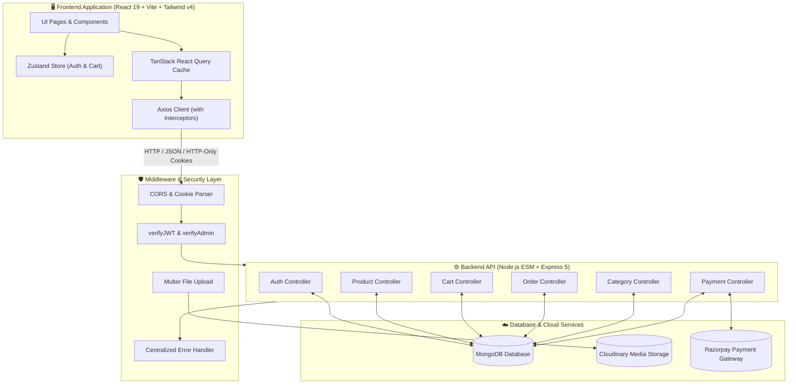

<div align="center">

# 🛍️ SHOPERA

**A Modern, High-Performance Full-Stack E-Commerce & Merchant Management Platform**

[](https://shopera-rho.vercel.app)
[](https://react.dev/)
[](https://vitejs.dev/)
[](https://tailwindcss.com/)
[](https://nodejs.org/)
[](https://expressjs.com/)
[](https://www.mongodb.com/)
[](https://razorpay.com/)
[](https://cloudinary.com/)
[](LICENSE)

<br/>

<p align="center">
  <a href="#-visual-showcase--gallery">Visual Showcase</a> •
  <a href="#-key-features">Key Features</a> •
  <a href="#-tech-stack">Tech Stack</a> •
  <a href="#-system-architecture">Architecture</a> •
  <a href="#-project-structure">Project Structure</a> •
  <a href="#-quick-start">Quick Start</a> •
  <a href="#-demo-credentials">Demo Credentials</a> •
  <a href="#-api-documentation">API Reference</a> •
  <a href="#-deployment">Deployment</a>
</p>

---

<p align="center">
  <a href="https://shopera-rho.vercel.app">
    
  </a>
</p>

</div>

## 📌 Overview

**Shopera** is an enterprise-grade, full-stack e-commerce and merchant administration platform engineered on the modern MERN stack with **React 19**, **Node.js (ES Modules)**, **Express 5**, and **MongoDB**. It pairs a consumer-facing shopping storefront with a comprehensive merchant administration back-office.

Designed for speed, scalability, and security, Shopera features npm monorepo workspaces, dual-token JWT authentication with secure HTTP-only cookies, automated database seeding of 50+ realistic products, Razorpay payment processing with cryptographic HMAC verification, dynamic delivery slot scheduling, instant GST invoice generation, and Cloudinary media management.

---

## 📸 Visual Showcase & Gallery

### 🛍️ 1. Storefront Discovery & Faceted Filtering
Explore products effortlessly with real-time category filters, price range sliders, brand selection, rating filters, instant search, and dynamic sorting.

<p align="center">
  
</p>

<table>
  <tr>
    <td width="50%" align="center">
      <b>⚡ Dynamic Faceted Filtering & Brands</b>
    </td>
    <td width="50%" align="center">
      <b>📄 Responsive Pagination & Product Grid</b>
    </td>
  </tr>
  <tr>
    <td>
      
    </td>
    <td>
      
    </td>
  </tr>
</table>

---

### 🔍 2. Rich Product Details & Buying Experience
Interactive product detail pages equipped with high-resolution image galleries, instant discount calculations, live stock warnings, coupon alerts, detailed specifications, and customer reviews.

<table>
  <tr>
    <td width="50%" align="center">
      <b>🏷️ Product Gallery, Pricing & Quick Add</b>
    </td>
    <td width="50%" align="center">
      <b>📋 Technical Specs & Trust Badges</b>
    </td>
  </tr>
  <tr>
    <td>
      
    </td>
    <td>
      
    </td>
  </tr>
</table>

---

### 💳 3. Frictionless 2-Step Checkout & Razorpay Payments
A multi-step checkout workflow with instant address management, GST calculation, Razorpay modal integration (UPI, QR, Cards, Netbanking), and sandbox test mode helpers.

<table>
  <tr>
    <td width="50%" align="center">
      <b>📍 Step 1: Delivery Address & Summary</b>
    </td>
    <td width="50%" align="center">
      <b>💳 Step 2: Payment Method Selection</b>
    </td>
  </tr>
  <tr>
    <td>
      
    </td>
    <td>
      
    </td>
  </tr>
  <tr>
    <td width="50%" align="center">
      <b>🔒 Native Razorpay Modal Integration</b>
    </td>
    <td width="50%" align="center">
      <b>🏦 Bank Gateway Authorization</b>
    </td>
  </tr>
  <tr>
    <td>
      
    </td>
    <td>
      
    </td>
  </tr>
</table>

---

### 📦 4. Order Confirmation, Tracking & Lifecycle Management
Instant order confirmation screen with real-time lifecycle tracking stepper (`Placed` ➔ `Confirmed` ➔ `Processing` ➔ `Shipped` ➔ `Delivered`), order history filtering, and cancellation workflows.

<table>
  <tr>
    <td width="50%" align="center">
      <b>🎉 Order Confirmation & Status Stepper</b>
    </td>
    <td width="50%" align="center">
      <b>🧾 Purchased Items & Verification Summary</b>
    </td>
  </tr>
  <tr>
    <td>
      
    </td>
    <td>
      
    </td>
  </tr>
  <tr>
    <td width="50%" align="center">
      <b>🚚 Order History & Real-Time Tracking</b>
    </td>
    <td width="50%" align="center">
      <b>⚙️ Order Actions & Status Breakdown</b>
    </td>
  </tr>
  <tr>
    <td>
      
    </td>
    <td>
      
    </td>
  </tr>
</table>

---

### 🧾 5. Delivery Scheduling & Instant Tax Invoicing
Customers can customize delivery time slots, add rider instructions, and download or print itemized GST tax invoices.

<table>
  <tr>
    <td width="50%" align="center">
      <b>📅 Custom Delivery Preferences & Slot Scheduling</b>
    </td>
    <td width="50%" align="center">
      <b>🖨️ Itemized GST Tax Invoice Modal</b>
    </td>
  </tr>
  <tr>
    <td>
      
    </td>
    <td>
      
    </td>
  </tr>
</table>

---

### 📊 6. Merchant Back-Office & Executive Analytics Console
Comprehensive administrative control center with real-time Gross Merchandise Value (GMV), Total Orders, Average Order Value (AOV), Warehouse Inventory Valuation, category share breakdowns, and fulfillment stats.

<table>
  <tr>
    <td width="50%" align="center">
      <b>📈 Executive Analytics & Quick Operational Hub</b>
    </td>
    <td width="50%" align="center">
      <b>📊 Category Distribution & Fulfillment Health</b>
    </td>
  </tr>
  <tr>
    <td>
      
    </td>
    <td>
      
    </td>
  </tr>
  <tr>
    <td width="50%" align="center">
      <b>🛡️ Unified Admin Navigation & CRM Controls</b>
    </td>
    <td width="50%" align="center">
      <b>🌟 Value Propositions & VIP Community Hub</b>
    </td>
  </tr>
  <tr>
    <td>
      
    </td>
    <td>
      
    </td>
  </tr>
</table>

---

## ✨ Key Features

### 🛒 Customer Storefront Experience
- **Dynamic Homepage & Catalog**: Promotional banners, trending badges, category navigation pills, and interactive product cards.
- **Multi-Parametric Filtering & Search**: Instant filtering by categories, price sliders, customer review ratings, in-stock status, and sorting algorithms (newest, price ascending/descending, popularity).
- **Product Detail Portal**: High-definition image galleries, live inventory thresholds, specification sheets, automated discount calculation, and review breakdowns.
- **Persistent Shopping Cart**: State-managed cart powered by Zustand with seamless synchronization across guest and authenticated user states.
- **2-Step Streamlined Checkout**: Frictionless checkout flow supporting multi-address books, instant address creation, and delivery instruction notes.
- **Payment Processing**: Integrated Razorpay payment gateway with cryptographic HMAC-SHA256 signature verification and Cash on Delivery (COD) fallback.
- **Live Order Tracking**: End-to-end status progression (`Placed` ➔ `Confirmed` ➔ `Processing` ➔ `Shipped` ➔ `Delivered`), order cancellation logic, and delivery preference scheduling.
- **Automated Invoicing**: Generation of printable GST-compliant tax invoices with unique transaction IDs and itemized tax breakdowns.
- **User Account Management**: Profile details, avatar uploads (Cloudinary), password change workflows, and address book configuration.

### ⚡ Merchant & Admin Back-Office
- **Executive Analytics Dashboard**: Real-time sales metrics (GMV), order volume, average ticket value (AOV), and total warehouse stock valuation.
- **Catalog Management (Full CRUD)**: Product creation, editing, inventory threshold monitoring, pricing, discount badges, and multi-image Cloudinary uploads.
- **Order Pipeline & Dispatch**: Process orders through lifecycle states, view customer delivery preferences, and manage dispatch statuses.
- **Category Hierarchy Management**: Full category management with automatic slug generation and visual banners.
- **Customer CRM & Role Escalation**: Customer directory, order history inspection, and role escalation (`customer` ⇋ `admin`).
- **Inventory & Stock Radar**: Live stock monitoring, low-stock warning triggers, and one-click restocking controls.
- **One-Click Catalog Seeding**: Automated and manual seeding utilities populated with 50+ rich e-commerce products across diverse categories.

### 🔒 Enterprise Security & Architecture
- **Dual-Token Authentication**: Short-lived JWT Access Tokens combined with secure, HTTP-only Refresh Tokens for session persistence.
- **Role-Based Access Control (RBAC)**: Secure route protection across both backend API middleware (`verifyJWT`, `verifyAdmin`) and client router guards (`AdminRoute`, `ProtectedRoute`).
- **Standardized API Layer**: Centralized error handling (`ApiError`), consistent JSON responses (`ApiResponse`), and async middleware wrapping (`asyncHandler`).
- **Client-Side Caching**: TanStack React Query v5 for server-state caching, background revalidation, and optimistic UI updates.

---

## 🛠️ Tech Stack

| Domain | Technology | Version | Description |
| :--- | :--- | :--- | :--- |
| **Frontend Framework** | [React](https://react.dev/) | `v19.x` | Modern UI library with concurrent features & state management |
| **Build Tool** | [Vite](https://vitejs.dev/) | `v8.x` | Next-generation frontend tooling with lightning-fast HMR |
| **Styling** | [Tailwind CSS](https://tailwindcss.com/) | `v4.x` | Utility-first CSS framework with modern color palettes |
| **Icons** | [Lucide React](https://lucide.dev/) | `v1.x` | Clean, customizable SVG iconography |
| **State Management** | [Zustand](https://zustand-demo.pmnd.rs/) | `v5.x` | Lightweight, scalable state store with persistent storage |
| **Data Fetching** | [TanStack React Query](https://tanstack.com/query) | `v5.x` | Async data fetching, server caching, and background sync |
| **Routing** | [React Router](https://reactrouter.com/) | `v7.x` | Client-side routing with nested layouts and route guards |
| **HTTP Client** | [Axios](https://axios-http.com/) | `v1.x` | Promise-based HTTP client with automatic cookie interceptors |
| **Backend Runtime** | [Node.js](https://nodejs.org/) | `v18+` | ECMAScript Modules (ESM) JavaScript runtime |
| **Web Framework** | [Express.js](https://expressjs.com/) | `v5.x` | Fast, unopinionated HTTP server framework |
| **Database & ODM** | [MongoDB](https://www.mongodb.com/) / [Mongoose](https://mongoosejs.com/) | `v8.x` | Schema-driven NoSQL database layer |
| **Authentication** | [JWT](https://jwt.io/) / [bcryptjs](https://github.com/dcodeIO/bcrypt.js) | `v9.x` / `v3.x` | Stateless dual-token authentication with salted hashing |
| **Payment Gateway** | [Razorpay SDK](https://razorpay.com/) | `v2.x` | Payment processing, webhook handling, and HMAC verification |
| **Media & Storage** | [Cloudinary](https://cloudinary.com/) / [Multer](https://github.com/expressjs/multer) | `v2.x` / `v2.x` | Cloud media CDN storage and multipart file upload parsing |
| **Monorepo Manager** | [npm Workspaces](https://docs.npmjs.com/cli/using-npm/workspaces) | `v9+` | Unified multi-package repository management |

---

## 🏗️ System Architecture



---

## 📁 Project Structure

```text
shopera/
├── client/                     # Frontend Application (React 19 + Vite 8)
│   ├── public/                 # Static assets & favicon
│   ├── src/
│   │   ├── api/                # Axios instance & interceptors
│   │   ├── assets/             # Brand logos, banners, icons
│   │   ├── components/         # Reusable UI component library
│   │   │   ├── admin/          # Admin console views (Analytics, Catalog, Orders, CRM)
│   │   │   ├── common/         # Buttons, badges, inputs, modals, cards
│   │   │   └── layout/         # Navbar, Footer, Category bar, Filters
│   │   ├── pages/              # Route views (Home, PDP, Cart, Checkout, Orders, Admin)
│   │   ├── routes/             # App router configuration & ProtectedRoute guards
│   │   ├── store/              # Zustand global stores (useAuthStore, useCartStore)
│   │   ├── utils/              # Formatting helpers (currency, date, status badges)
│   │   ├── App.jsx             # Main application component
│   │   ├── index.css           # Tailwind CSS styles & design tokens
│   │   └── main.jsx            # React root mounting
│   ├── .env.example            # Client environment variables blueprint
│   ├── package.json            # Client dependencies
│   └── vite.config.js          # Vite build configuration
│
├── server/                     # Backend API (Node.js ESM + Express 5)
│   ├── src/
│   │   ├── config/             # MongoDB, Cloudinary & Razorpay configurations
│   │   ├── controllers/        # Request handling & business logic
│   │   ├── middlewares/        # JWT auth, role validation, file upload
│   │   ├── models/             # Mongoose schemas (User, Product, Order, Category)
│   │   ├── routes/             # Express API endpoint routers
│   │   ├── scripts/            # Database seeding utilities (seed50Products, seedDemoUsers)
│   │   ├── utils/              # ApiResponse, ApiError, AsyncHandler utilities
│   │   └── app.js              # Express application setup & middleware registration
│   ├── .env.example            # Backend environment variables blueprint
│   ├── package.json            # Server dependencies
│   └── server.js               # Entry point (DB connection & HTTP listener)
│
├── images/                     # Project screenshots & visual assets
├── package.json                # Monorepo root workspace configuration
└── README.md                   # Project documentation
```

---

## 🚀 Quick Start

Follow these steps to set up and run the full stack locally.

### 1. Prerequisites
Ensure you have the following installed on your machine:
- **Node.js**: `v18.0.0` or higher ([Download Node.js](https://nodejs.org/))
- **npm**: `v9.0.0` or higher
- **MongoDB**: Local MongoDB instance or a free [MongoDB Atlas](https://www.mongodb.com/cloud/atlas) cluster.

---

### 2. Clone the Repository
```bash
git clone https://github.com/rahul-rathore-sd/shopera.git
cd shopera
```

---

### 3. Install All Dependencies
Install dependencies across both `client` and `server` workspaces with a single command from the root directory:
```bash
npm install
```

---

### 4. Configure Environment Variables

#### Backend Configuration
Create a `.env` file in the `server/` directory:

```bash
# Windows PowerShell
copy server\.env.example server\.env

# Linux / macOS
cp server/.env.example server/.env
```

Populate `server/.env` with your credentials:
```env
# Server Configuration
PORT=8000
NODE_ENV=development
CLIENT_ORIGIN=http://localhost:5173
CORS_ORIGIN=http://localhost:5173

# Database Connection
MONGO_URI=mongodb://127.0.0.1:27017/shopera

# Authentication & JWT Secrets
JWT_ACCESS_SECRET=your_super_secret_jwt_access_key_min_32_characters
JWT_REFRESH_SECRET=your_super_secret_jwt_refresh_key_min_32_characters
ACCESS_TOKEN_EXPIRY=15m
REFRESH_TOKEN_EXPIRY=7d

# Cloudinary (Optional for local testing, required for image uploads)
CLOUDINARY_CLOUD_NAME=your_cloudinary_cloud_name
CLOUDINARY_API_KEY=your_cloudinary_api_key
CLOUDINARY_API_SECRET=your_cloudinary_api_secret

# Razorpay (Optional for local mock payments, required for live gateway)
RAZORPAY_KEY_ID=your_razorpay_key_id
RAZORPAY_KEY_SECRET=your_razorpay_key_secret
RAZORPAY_WEBHOOK_SECRET=your_razorpay_webhook_secret
```

#### Frontend Configuration
Create a `.env` file in the `client/` directory:

```bash
# Windows PowerShell
copy client\.env.example client\.env

# Linux / macOS
cp client/.env.example client/.env
```

Configure the backend API URL in `client/.env`:
```env
VITE_API_BASE_URL=http://localhost:8000/api/v1
```

---

### 5. Seed the Database (Optional)
The server automatically creates demo users and seeds products if the database is empty upon startup. You can also trigger seeding manually:

```bash
# Seed 50+ rich demo products
npm run seed:all --workspace=server

# Seed demo users (Admin & Customer)
npm run seed:users --workspace=server
```

---

### 6. Run the Application
Launch both backend and frontend concurrently from the root workspace:

```bash
npm run dev
```

- **Frontend Application**: [`http://localhost:5173`](http://localhost:5173)
- **Backend API**: [`http://localhost:8000`](http://localhost:8000)
- **Health Check Endpoint**: [`http://localhost:8000/api/v1/health`](http://localhost:8000/api/v1/health)

---

## 🔑 Demo Credentials

Pre-configured accounts for immediate evaluation:

| Role | Email | Password | Capabilities |
| :--- | :--- | :--- | :--- |
| **👑 Admin** | `admin@shopera.demo` | `Admin@12345` | Full access to Admin Console, Analytics, Product CRUD, Order Status Management, CRM |
| **🛍️ Customer** | `customer@shopera.demo` | `Customer@12345` | Storefront browsing, Cart, 2-Step Checkout, Order Tracking, Invoices, Profile |

---

## 📚 API Documentation

All API endpoints are prefixed with `/api/v1`.

### 🔐 Authentication & Profile (`/api/v1/auth`)
| Method | Endpoint | Access | Description |
| :--- | :--- | :--- | :--- |
| `POST` | `/register` | Public | Register a new user account |
| `POST` | `/login` | Public | Authenticate user & issue JWT cookies |
| `POST` | `/refresh-token` | Public | Refresh expired access token using refresh cookie |
| `POST` | `/logout` | Protected | Invalidate session & clear auth cookies |
| `GET` | `/me` | Protected | Fetch current logged-in user profile |
| `PATCH` | `/change-password` | Protected | Update account password |
| `PATCH` | `/update-account` | Protected | Update user profile information |
| `PATCH` | `/avatar` | Protected | Upload new profile avatar (`multipart/form-data`) |
| `GET` | `/addresses` | Protected | List all saved user addresses |
| `POST` | `/addresses` | Protected | Add a new delivery address |
| `PUT` | `/addresses/:addressId` | Protected | Update an existing delivery address |
| `DELETE` | `/addresses/:addressId` | Protected | Remove a saved address |
| `PATCH` | `/addresses/:addressId/default` | Protected | Set default shipping address |
| `GET` | `/admin/users` | Admin | List all registered users (CRM) |
| `PATCH` | `/admin/users/:id/role` | Admin | Change user role (`admin` / `customer`) |

### 📦 Product Catalog (`/api/v1/products`)
| Method | Endpoint | Access | Description |
| :--- | :--- | :--- | :--- |
| `GET` | `/` | Public | Retrieve paginated products with filtering & search |
| `GET` | `/slug/:slug` | Public | Fetch single product by unique slug |
| `GET` | `/id/:id` | Admin | Fetch single product by Mongo ID |
| `POST` | `/` | Admin | Create a new product with image uploads |
| `PUT` | `/:id` | Admin | Update existing product details & inventory |
| `DELETE` | `/:id` | Admin | Delete a product |
| `POST` | `/admin/seed` | Admin | Trigger catalog re-seed |

### 🗂️ Categories (`/api/v1/categories`)
| Method | Endpoint | Access | Description |
| :--- | :--- | :--- | :--- |
| `GET` | `/` | Public | List all active product categories |
| `GET` | `/:slug` | Public | Get single category by slug |
| `POST` | `/` | Admin | Create a new product category |
| `PUT` | `/:id` | Admin | Update category name, description, banner |
| `DELETE` | `/:id` | Admin | Remove a category |

### 🛒 Shopping Cart (`/api/v1/cart`)
| Method | Endpoint | Access | Description |
| :--- | :--- | :--- | :--- |
| `GET` | `/` | Protected | Get authenticated user's cart |
| `POST` | `/` | Protected | Add item to cart or increment quantity |
| `PUT` | `/item/:itemId` | Protected | Update item quantity in cart |
| `DELETE` | `/item/:itemId` | Protected | Remove specific item from cart |
| `DELETE` | `/` | Protected | Clear entire shopping cart |

### 🧾 Orders (`/api/v1/orders`)
| Method | Endpoint | Access | Description |
| :--- | :--- | :--- | :--- |
| `POST` | `/` | Protected | Create order from cart items |
| `GET` | `/` | Protected | Get logged-in user's order history |
| `GET` | `/:id` | Protected | Retrieve full order details by ID |
| `PATCH` | `/:id/delivery-preferences`| Protected | Update delivery notes & time preferences |
| `PUT` | `/:id/cancel` | Protected | Cancel an active order |
| `PUT` | `/:id/status` | Admin | Update order lifecycle status (`Processing`, `Shipped`, etc.) |

### 💳 Payments (`/api/v1/payments`)
| Method | Endpoint | Access | Description |
| :--- | :--- | :--- | :--- |
| `POST` | `/create-order` | Protected | Create Razorpay order for checkout |
| `POST` | `/verify-signature` | Protected | Verify HMAC-SHA256 signature after payment capture |
| `POST` | `/webhook` | Public | Razorpay webhook listener for asynchronous events |

---

## 💻 Available Scripts

| Command | Workspace | Description |
| :--- | :--- | :--- |
| `npm run dev` | Root | Concurrently runs backend and frontend dev servers |
| `npm run dev:server` | Root | Runs backend server in watch mode with `nodemon` |
| `npm run dev:client` | Root | Runs frontend development server with Vite |
| `npm run build` | Root / Client | Builds production-optimized frontend bundle |
| `npm run start` | Root / Server | Starts production Node.js server |
| `npm run seed:all` | Server | Seeds database with 50+ demo products |
| `npm run seed:users` | Server | Seeds default Admin and Customer demo accounts |
| `npm run lint` | Client | Runs Oxlint linter for code quality checks |

---

## 🌐 Deployment

### Deploying the Backend (Render / Railway / AWS)
1. Create a Web Service pointing to your repository.
2. **Build Command**: `npm install`
3. **Start Command**: `npm start`
4. Set the environment variables defined in `server/.env.example`.
5. Set `NODE_ENV=production` and add your frontend production URL to `CORS_ORIGIN`.

### Deploying the Frontend (Vercel / Netlify)
1. Import your repository into Vercel / Netlify and set the Root Directory to `client`.
2. **Build Command**: `npm run build`
3. **Output Directory**: `dist`
4. Set Environment Variable: `VITE_API_BASE_URL=https://your-backend-api.onrender.com/api/v1`.

---

## 🤝 Contributing

Contributions make the open-source community an extraordinary place to learn, inspire, and create. Any contributions you make are **greatly appreciated**.

1. Fork the Project
2. Create your Feature Branch (`git checkout -b feature/AmazingFeature`)
3. Commit your Changes (`git commit -m 'Add some AmazingFeature'`)
4. Push to the Branch (`git push origin feature/AmazingFeature`)
5. Open a Pull Request

---

## 📄 License

Distributed under the **ISC License**. See `LICENSE` for more details.

---

<div align="center">

Made with ❤️ by [Rahul Rathore](https://github.com/rahul-rathore-sd)

[](https://github.com/rahul-rathore-sd)
[](https://shopera-rho.vercel.app)

</div>
